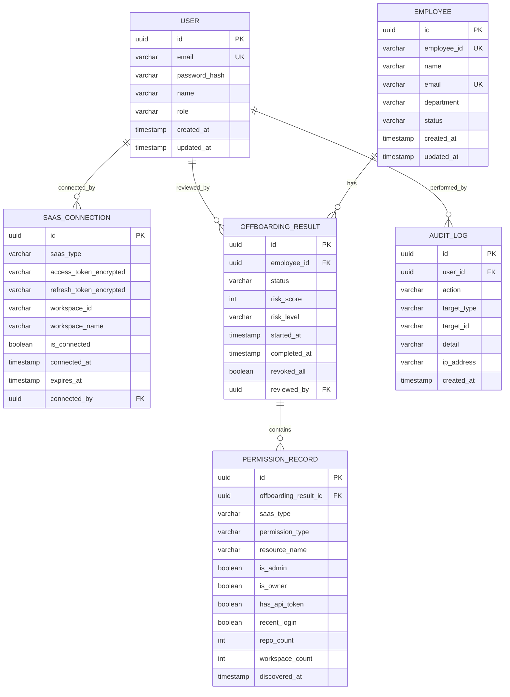

# ORAM ERD (Entity Relationship Diagram)

## ERD Diagram (Mermaid)

---

## Table Descriptions

### USER
관리자 계정 테이블. RBAC 역할(Admin, SecurityManager, Auditor)을 저장.

| Column | Type | Description |
|--------|------|-------------|
| id | UUID | PK (자동 생성) |
| email | VARCHAR(255) | 로그인 이메일 (Unique) |
| password_hash | VARCHAR(255) | BCrypt 해시 |
| name | VARCHAR(100) | 표시 이름 |
| role | VARCHAR(50) | ADMIN / SECURITY_MANAGER / AUDITOR |
| created_at | TIMESTAMP | 생성 시각 |
| updated_at | TIMESTAMP | 수정 시각 |

### EMPLOYEE
HR 시스템에서 관리하는 직원 정보.

| Column | Type | Description |
|--------|------|-------------|
| id | UUID | PK |
| employee_id | VARCHAR(50) | 사번 (Unique) |
| name | VARCHAR(100) | 이름 |
| email | VARCHAR(255) | 회사 이메일 (Unique) |
| department | VARCHAR(100) | 부서 |
| status | VARCHAR(20) | ACTIVE / RESIGNED |

### SAAS_CONNECTION
연결된 SaaS OAuth 토큰 정보. 토큰은 AES-256-GCM 암호화.

| Column | Type | Description |
|--------|------|-------------|
| id | UUID | PK |
| saas_type | VARCHAR(50) | SLACK / GITHUB / NOTION |
| access_token_encrypted | TEXT | 암호화된 액세스 토큰 |
| refresh_token_encrypted | TEXT | 암호화된 리프레시 토큰 |
| workspace_id | VARCHAR(255) | SaaS 워크스페이스 ID |
| workspace_name | VARCHAR(255) | SaaS 워크스페이스 이름 |
| is_connected | BOOLEAN | 연결 상태 |
| connected_at | TIMESTAMP | 연결 시각 |
| expires_at | TIMESTAMP | 토큰 만료 시각 |

### OFFBOARDING_RESULT
오프보딩 워크플로우 실행 결과.

| Column | Type | Description |
|--------|------|-------------|
| id | UUID | PK |
| employee_id | UUID | FK → EMPLOYEE |
| status | VARCHAR(20) | PENDING / IN_PROGRESS / COMPLETED / FAILED |
| risk_score | INTEGER | 0~100 리스크 점수 |
| risk_level | VARCHAR(20) | LOW / MEDIUM / HIGH / CRITICAL |
| started_at | TIMESTAMP | 시작 시각 |
| completed_at | TIMESTAMP | 완료 시각 |
| revoked_all | BOOLEAN | 전체 권한 해제 여부 |

### PERMISSION_RECORD
각 SaaS에서 발견된 권한 기록.

| Column | Type | Description |
|--------|------|-------------|
| id | UUID | PK |
| offboarding_result_id | UUID | FK → OFFBOARDING_RESULT |
| saas_type | VARCHAR(50) | SLACK / GITHUB / NOTION |
| permission_type | VARCHAR(100) | e.g., ADMIN, MEMBER, OWNER |
| resource_name | VARCHAR(255) | e.g., org/repo 이름 |
| is_admin | BOOLEAN | XGBoost 피처: 관리자 여부 |
| is_owner | BOOLEAN | XGBoost 피처: 소유자 여부 |
| has_api_token | BOOLEAN | XGBoost 피처: API 토큰 보유 여부 |
| recent_login | BOOLEAN | XGBoost 피처: 최근 로그인 여부 |
| repo_count | INTEGER | XGBoost 피처: 접근 가능 저장소 수 |
| workspace_count | INTEGER | XGBoost 피처: 접근 가능 워크스페이스 수 |

### AUDIT_LOG
모든 접근 변경 이력 감사 로그.

| Column | Type | Description |
|--------|------|-------------|
| id | UUID | PK |
| user_id | UUID | FK → USER (수행자) |
| action | VARCHAR(100) | CONNECT / DISCONNECT / OFFBOARD / REVOKE 등 |
| target_type | VARCHAR(50) | EMPLOYEE / SAAS_CONNECTION 등 |
| target_id | VARCHAR(255) | 대상 리소스 ID |
| detail | TEXT | 상세 설명 |
| ip_address | VARCHAR(45) | 요청 IP |
| created_at | TIMESTAMP | 발생 시각 |
